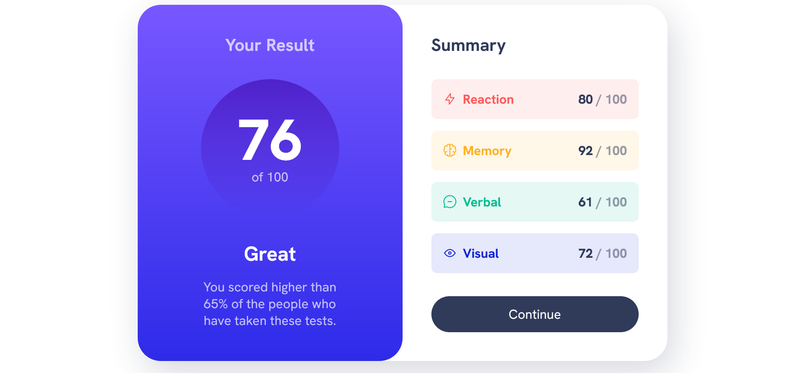

# Frontend Mentor - Results summary component

## Welcome! 👋

Users are be able to:

- View the optimal layout for the interface depending on their device's screen size
- See hover and focus states for all interactive elements on the page
- **Bonus**: Use the local JSON data to dynamically populate the content
